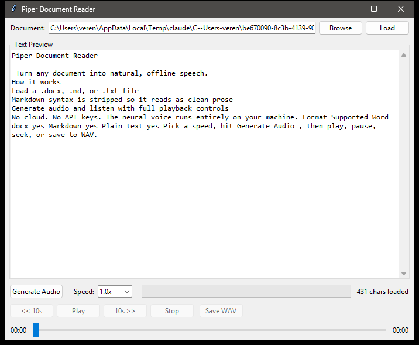

# Piper Document Reader

**A simple desktop app that reads your documents aloud using [Piper](https://github.com/OHF-Voice/piper1-gpl) neural text-to-speech.**

Load a Word document, Markdown file, or plain-text file, generate natural-sounding speech locally on your machine, and listen with full playback controls — play/pause, skip, seek, adjustable speed, and save to WAV. No cloud, no API keys, everything runs offline.

  



*Markdown is cleaned automatically — headings, tables, and symbols become natural prose ready to speak.*

---

## Features

- **Reads `.docx`, `.md`/`.markdown`, and `.txt` files** — Markdown syntax (headings, badges, links, tables, code spans) is stripped automatically so it reads naturally.
- **Offline neural TTS** — powered by Piper voice models; no internet connection required.
- **Full playback controls** — play, pause, stop, rewind 10s, forward 10s, and a draggable seek bar.
- **Adjustable speed** — 0.5x to 2.0x presets.
- **Save to WAV** — export the generated audio to a file.
- **Drag-and-drop friendly CLI** — pass a file path as an argument to load it on launch.

## Quick Start

### Option 1 — Download the executable

Grab the latest `PiperReader.exe` from the [Releases](https://github.com/rainfantry/piper-reader/releases) page. **The voice model is bundled inside the `.exe`** — no Python install, no separate download, fully offline out of the box. Just run it.

### Option 2 — Run from source

```bash
git clone https://github.com/rainfantry/piper-reader.git
cd piper-reader
pip install -r requirements.txt
python piper_reader.py
```

## Voice model

The released `PiperReader.exe` ships with the `en_US-lessac-medium` voice baked in — nothing to download.

When running **from source**, the app looks for the model in this order:

1. Bundled inside the executable (release builds only)
2. Next to the executable / `piper_reader.py`
3. Your home folder: `~/en_US-lessac-medium.onnx` (+ `.onnx.json`)

Download voices from the [Piper voices collection](https://huggingface.co/rhasspy/piper-voices) and place both the `.onnx` and `.onnx.json` files in one of those locations. To use a different voice, change `MODEL_NAME` near the top of `piper_reader.py`.

## Usage

1. Launch the app (`PiperReader.exe` or `python piper_reader.py`).
2. Click **Browse** and pick a `.docx`, `.md`, or `.txt` file — or paste a path and click **Load**.
3. Review the extracted text in the preview pane.
4. Pick a **Speed**, then click **Generate Audio**.
5. Use the playback controls to listen, and **Save WAV** to export.

You can also launch with a file directly:

```bash
python piper_reader.py "C:\path\to\document.md"
```

## Requirements

- Python 3.10 or newer
- [`piper-tts`](https://pypi.org/project/piper-tts/)
- [`pygame`](https://pypi.org/project/pygame/) (audio playback)
- [`python-docx`](https://pypi.org/project/python-docx/) (Word document support)
- `tkinter` (bundled with standard CPython on Windows)

## Building the executable

The release binary is built with [PyInstaller](https://pyinstaller.org/). To produce a self-contained build with the voice model baked in:

```bash
pip install pyinstaller
pyinstaller --onefile --windowed --name PiperReader \
  --collect-all piper --collect-all onnxruntime \
  --add-data "en_US-lessac-medium.onnx;." \
  --add-data "en_US-lessac-medium.onnx.json;." \
  piper_reader.py
```

- `--collect-all piper` is **required** — Piper bundles `espeakbridge.pyd` and the `espeak-ng-data/` dictionaries; without them synthesis fails at runtime.
- The two `--add-data` flags embed the voice model so the `.exe` runs with no external files. Drop them for a smaller binary that loads the model from disk instead.

The result lands in `dist/PiperReader.exe`.

## License

Released under the [MIT License](LICENSE).
